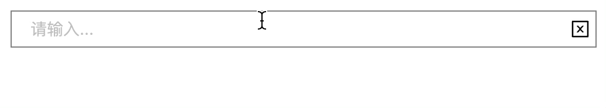
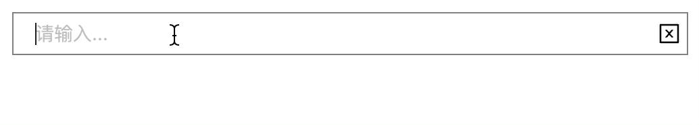

# InputTag 进阶功能: Tag 折叠

## 概述

在 [InputTag 简版实现](../%5B%E9%A1%B9%E7%9B%AE%5D%20InputTag%20%E7%AE%80%E7%89%88%E5%AE%9E%E7%8E%B0/README.md) 中，我们已经初步实现了 InputTag 组件的基础功能。但落地到实际应用场景时发现，当固定 InputTag 组件宽度后，随着 Tag 数量的增加，会自动发生换行，从而挤压其他页面布局空间。因此，我们需要为 InputTag 新增 Tag 标签折叠的功能，当标签数量或者宽度超过设定阈值时，自动折叠。

## 实现目标

Tag 自动折叠的关键在于计算 Tag 宽度(数量)是否超出设定阈值。为了获取 Tag 的宽度，React 需要生成相应的 Tag DOM 实例并调用相应的样式获取方法，同时，为了避免频闪现象的发生，我们需要在计算完 Tag 宽度之后，立刻重置样式并正确渲染可被展示的 Tag 标签，折叠剩余的 Tag 标签。

此外，为了尽量避免破坏原有 InputTag 组件的基础逻辑，同时实现逻辑的抽离与复用，本文尝试借鉴 Headless UI 的设计思想，尽可能地抽离了 Tag 宽度计算及阈值判断的逻辑。同时，还为折叠标签的弹出组件预留了相应的插槽，为使用者提供了最大可能的自由度。
> (什么是 Headless UI? 可阅读 [全新的 React 组件设计理念 Headless UI](https://juejin.cn/post/7160223720236122125) 了解)

总结而言，我们需要实现以下几个目标:

- [x] Tag 宽度计算
- [x] 宽度计算逻辑抽离

## useTags

### 核心计算

我们将 Tags 的宽度收集与计算抽离到了 useTags 中，在 useTags 中，主要接受两个参数:

- maxWidth: 最大宽度阈值
- maxCount: 最大数量阈值

为了获取 `<Tag />` 组件数组的所有实例，我们暴露了 `getRefs()` 方法，通过 ref 回调的方式获取:

```js
const refs = []
array.map(item => (
  <Component ref={(ref) => {refs.push(ref)}} />
))
```

获取到组件实例后，调用 `ELEMENT.getBoundingClientRect()` 方法获取 DOM 元素的空间占用对象，然后依次累加计算宽度并判断是否超出阈值。并给超出阈值的索引位置添加标记。代码如下所示:

```js
// 始终获取最新的 Tag DOM 实例
// @tian 此处不用记忆化存储的原因在于: <Tag /> 基于数组产出，其 ref 会在每次重渲染时更新，记忆化存储需要定义较多的依赖项，且在每次重渲染前清空，开发负担较重。
const refs: any[] = [];
const getRefs = (ref: any) => {
  refs.push(ref);
};
// 标记: 记录 <Tag /> 开始隐藏的索引位置。
// @tian 此处用 useState 目的在于触发重渲染。
const [startHiddenIndex, setStartHiddenIndex] = useState(Infinity);
// 判断宽度是否超出阈值
// @tian 每次重渲染均进行判断。
// 优点: 能始终保持正确的样式，不需要考虑多种情况
// 缺点: 随着 <Tag /> 数的增加，是否存在性能问题有待验证; useLayoutEffect 中调用了 setState，易发生死循环。
useLayoutEffect(() => {
  if (refs.length) {
    let width = 0;
    let flag = true;
    for (let i = 0; i < refs.length; i++) {
      const ref = refs[i];
      // maxCount 优先
      if (maxCount) {
        if (i > maxCount - 1) {
          ref.style.display = "none";
          if (flag) {
            // 触发重渲染，确保正确展示视图。
            // @tian 注意: 触发重渲染后，必然会再执行一次 useLayoutEffect，会产生额外的性能开销且易发生死循环(此处不会)，待解决？
            setStartHiddenIndex(i);
            flag = false;
          }
        }
      } else if (maxWidth) {
        if (width > maxWidth) {
          // 超出阈值部分设置样式隐藏，且记录隐藏位置。
          ref.style.display = "none";
          if (flag) {
            setStartHiddenIndex(i);
            flag = false;
          }
        } else {
          // 累加宽度
          width += ref.getBoundingClientRect().width + tagMargin;
        }
      }
    }
  }
});
```

值得关注的地方有几点:

1. 对于 ref 实例的存储，我们并没有将其用 useRef/useState/... 等记忆化保留。而是在每次组件重渲染时重新获取，保证 ref 实例对象始终最新，能有效避免很多潜在的 Bug。
2. 宽度计算放在 useLayoutEffect 中执行。useLayoutEffect 阶段，组件实例已生成，且此时还未被渲染到页面上 (React 维护了视图树与内存树，useLayoutEffect 阶段内存树最新，但还没有被切换到视图中)，此时我们可以获取到最新的页面布局及组件宽度。
3. 需要隐藏的 Tag 索引位置标记我们采用 useState 存储，同时结合 useLayoutEffect 可以实现无缝、无频闪的 Tag 折叠渲染过程。我们已知在 useLayoutEffect 阶段视图并不会发生更新，此时我们完成宽度计算并触发重渲染，React 会中断本次渲染，直接进行最新的渲染操作。useEffect 就不能达到上述效果，因为在 useEffect 阶段，视图已经被更新了。

### 完整代码(总结)

基于宽度阈值折叠 <Tag /> 的难点在于如何获取隐藏组件的宽度。

我们可以通过 ref 或者 ref callback 轻松获取到已渲染的组件 DOM 实例，但对于未被渲染到视图的组件而言，我们无法获取其实例对象，react 并不会为这些在视图中不被渲染的节点创建真实 DOM，我们自然也无法获取到相应的宽高。

关于折叠 Tag 宽度计算的思路:

1. 先将所有的 `<Tag />` 渲染到视图中，这一步确保了真实 DOM 实例的生成，可通过 ref 获取相应的宽高。
2. 在 useLayoutEffect 中对渲染进行拦截，在将 `<Tag />` 真实渲染到视图前判断宽度阈值，隐藏超出部分的 `<Tag />` (设置为 display:none) 并且标记折叠位置。
3. 触发重渲染，中断本次的渲染。

```js
import { useLayoutEffect, useState } from "react";
import { useImmerReducer, ImmerReducer } from "use-immer";
import { v4 as uuid } from "uuid";

type StateType = {
  tag: string | undefined;
  tags: string[];
};
type ActionType =
  | { type: "setTag"; payload?: string }
  | { type: "addTag"; payload: string }
  | { type: "removeTag"; payload: number }
  | { type: "clearTags"; payload?: never };

export const useTags = ({
  tagMargin = 10,
  maxWidth,
  maxCount,
}: {
  tagMargin?: number;
  maxWidth?: number;
  maxCount?: number;
}) => {
  // 存储状态
  const initialState = {
    tag: undefined,
    tags: [],
  };
  const reducer: ImmerReducer<StateType, ActionType> = (state, action) => {
    const { type, payload } = action;
    switch (type) {
      case "setTag":
        state.tag = payload;
        break;
      case "addTag":
        state.tags.push(payload);
        break;
      case "removeTag":
        state.tags.splice(payload, 1);
        break;
      case "clearTags":
        state.tags.length = 0;
        break;
    }
  };
  const [state, dispatch] = useImmerReducer<StateType, ActionType>(
    reducer,
    initialState
  );

  // 一系列操作
  const addTag = (tag: string) => {
    if (state.tags.every((t) => t !== tag)) {
      dispatch({ type: "addTag", payload: tag });
      dispatch({ type: "setTag", payload: undefined });
    }
  };

  const removeTag = (idx: number) => {
    dispatch({ type: "removeTag", payload: idx });
  };

  const clearTags = () => {
    dispatch({ type: "clearTags" });
  };

  // 始终获取最新的 Tag DOM 实例
  // @tian 此处不用记忆化存储的原因在于: <Tag /> 基于数组产出，其 ref 会在每次重渲染时更新，记忆化存储需要定义较多的依赖项，且在每次重渲染前清空，开发负担较重。
  const refs: any[] = [];
  const getRefs = (ref: any) => {
    refs.push(ref);
  };
  // 标记: 记录 <Tag /> 开始隐藏的索引位置。
  // @tian 此处用 useState 目的在于触发重渲染。
  const [startHiddenIndex, setStartHiddenIndex] = useState(Infinity);
  // 判断宽度是否超出阈值
  // @tian 每次重渲染均进行判断。
  // 优点: 能始终保持正确的样式，不需要考虑多种情况
  // 缺点: 随着 <Tag /> 数的增加，是否存在性能问题有待验证; useLayoutEffect 中调用了 setState，易发生死循环。
  useLayoutEffect(() => {
    if (refs.length) {
      let width = 0;
      let flag = true;
      for (let i = 0; i < refs.length; i++) {
        const ref = refs[i];
        // maxCount 优先
        if (maxCount) {
          if (i > maxCount - 1) {
            ref.style.display = "none";
            if (flag) {
              // 触发重渲染，确保正确展示视图。
              // @tian 注意: 触发重渲染后，必然会再执行一次 useLayoutEffect，会产生额外的性能开销且易发生死循环(此处不会)，待解决？
              setStartHiddenIndex(i);
              flag = false;
            }
          }
        } else if (maxWidth) {
          if (width > maxWidth) {
            // 超出阈值部分设置样式隐藏，且记录隐藏位置。
            ref.style.display = "none";
            if (flag) {
              setStartHiddenIndex(i);
              flag = false;
            }
          } else {
            // 累加宽度
            width += ref.getBoundingClientRect().width + tagMargin;
          }
        }
      }
    }
  });

  // @tian headless UI 思想: 将 state 和 logic 分离到 hooks 中导出，确保 UI 和状态逻辑的分离。
  return {
    // 状态
    tagsOnShow: state.tags,
    tagsOnHidden: state.tags.slice(startHiddenIndex),
    // 方法
    addTag,
    removeTag,
    clearTags,
    getInputProps: () => ({
      value: state.tag,
      onChange: (e: any) => {
        dispatch({ type: "setTag", payload: e.target.value });
      },
      onPressEnter: () => {
        state.tag && addTag(state.tag);
      },
    }),
    getTagsOnShowProps: (tag: string, idx: number) => ({
      key: uuid(),
      ref: getRefs,
      onClose: (e: any) => {
        e.preventDefault();
        removeTag(idx);
      },
    }),
    getTagsOnHiddenProps: (tag: string, idx: number) => ({
      key: uuid(),
      onClose: (e: any) => {
        e.preventDefault();
        removeTag(startHiddenIndex + idx);
      },
    }),
    getClearButtonProps: () => ({
      onMouseDown: (e: any) => {
        e.preventDefault();
        clearTags();
      },
    }),
  };
};
```

### 存在的问题

上述思路实现的宽度计算仍存在一定的问题:

1. 性能开销: 为了确保渲染结果始终正确，我们不得不忽略了 useLayoutEffect 的所有依赖项，并在每次重渲染的时候都计算正确的宽度及隐藏位置。该方法对于开发者而言负担较小，但是重复的计算和渲染可能会存在一定的性能开销(有待验证)。
2. 不符合最佳实践: 由于忽略了 useLayoutEffect 的依赖项，并且在 useLayoutEffect 中触发了重渲染。这会导致重渲染后重复执行 useLayoutEffect 流程，维护不当很有可能造成死循环(目前不会有该问题，因为浅比较相同的情况下，第二次 setState 并不会触发重渲染)。

## 整体代码

本文 InputTag 进阶版实现是基于 antd 的二次封装方案。我们基于 `<Input />` + `<Tag />` 实现基础的功能，同时注入 `useTags` 方法，实现标签宽度的自动计算。
在 `<Tag />` 标签展示部分，我们以 `useTags` 计算出的标记索引为界限，分割 Tags 标签的可视和不可视部分。

我们为每个 `<Tag />` 都注入了 ref 回调 `getRefs()` 方法，确保我们在每次重渲染过程中，都能收集到完整的 ref 实例数组，从而正确计算宽度及临界阈值。

为了给予使用者最大化定制组件的自由度，我们使用了 `React.cloneElement()` 以及 children props 等方法，将需要被折叠的 `<Tag />` 标签数组作为参数传递给 children props 接口，使用者可根据实际情况，引用不同的组件 (例如 `<Popover />` 或 `<Tooltip />` 定制不同的样式)。
> 此处 `React.cloneElement()` 的主要作用是为了传递 props 参数。

```js
import React, { useImperativeHandle, useRef } from "react";
import { Input, Tag, InputRef } from "antd";
import _ from "lodash";
import { CloseSquareOutlined } from "@ant-design/icons";
import "antd/dist/reset.css";
import "./index.scss";
import { useTags } from "./useTags";

export type TagType = { id: string; value: string };
type InputTagProps = {
  style?: React.CSSProperties;
  width?: number;
  maxCount?: number; // 最多tag展示数
  maxWidth?: number;
  wrapper?: (Tags: React.ReactNode) => React.ReactElement;
};
const InputTag: React.ForwardRefRenderFunction<any, InputTagProps> = (
  $props,
  ref
) => {
  const props = _.defaults($props, { width: 400 });
  const MIN_INPUT_WIDTH = 100;

  const inputRef = useRef<InputRef>(null!);
  useImperativeHandle(
    ref,
    () => {
      return {
        focus() {
          inputRef.current.focus();
        },
        blur() {
          inputRef.current.blur();
        },
      };
    },
    []
  );

  // 宽度计算逻辑
  const {
    tagsOnShow,
    tagsOnHidden,
    getInputProps,
    getTagsOnShowProps,
    getTagsOnHiddenProps,
    getClearButtonProps,
  } = useTags({
    tagMargin: 10,
    maxWidth: props.maxWidth,
    maxCount: props.maxCount,
  });

  return (
    <div
      ref={ref}
      className={"tag-container"}
      style={{
        width: props.width,
        ...props.style,
      }}
    >
      {/* tag 展示部分 */}
      {tagsOnShow.map((tag, idx) => (
        <Tag bordered closable {...getTagsOnShowProps(tag, idx)}>
          {tag}
        </Tag>
      ))}
      {/* tag 隐藏部分 */}
      {/* 此处用 React.cloneElement 设置插槽，可传入 Popover，Tooltip 等组件 */}
      {props.wrapper && tagsOnHidden.length
        ? React.cloneElement(
            props.wrapper(
              tagsOnHidden.map((tag, idx) => (
                <Tag bordered closable {...getTagsOnHiddenProps(tag, idx)}>
                  {tag}
                </Tag>
              ))
            )!,
            {
              children: (
                <Tag bordered closable={false}>{`+${tagsOnHidden.length}`}</Tag>
              ),
            }
          )
        : null}
      <Input
        ref={inputRef}
        placeholder="请输入..."
        style={{ minWidth: MIN_INPUT_WIDTH, flex: "1 1" }}
        bordered={false}
        {...getInputProps()}
      />
      <CloseSquareOutlined
        rev={undefined}
        style={{ marginLeft: "auto" }}
        {...getClearButtonProps()}
      />
    </div>
  );
};

export default React.forwardRef(InputTag);
```

## 实现效果

限制 `<Tag />` 的最大数量:



限制 `<Tag />` 的最大宽度:



---

**[项目地址](https://github.com/jtwang7/UI-Library/tree/master/src/components/input-tag)**

**✨ 欢迎关注我的 [github](https://github.com/jtwang7)，🥳个人学习总结、项目开发、前端代码手撕等好物多多！**